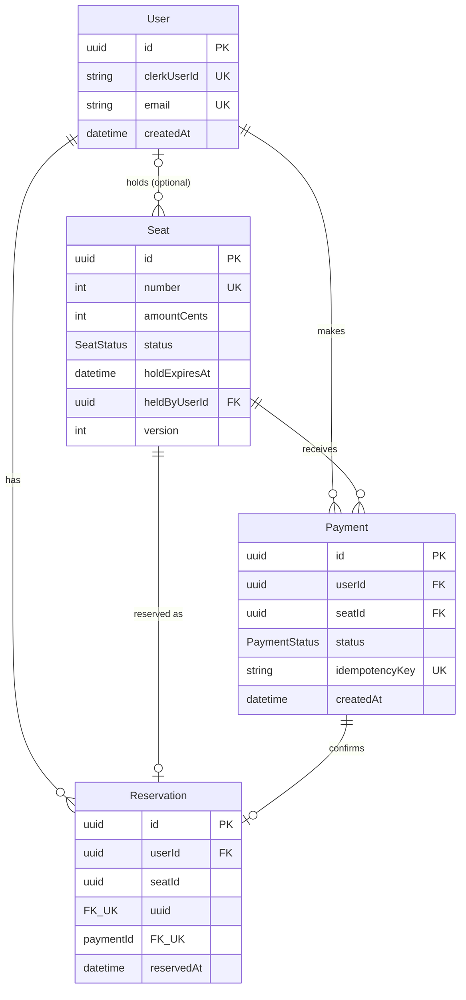

# Seat Reservation Platform

A simple public seat reservation app where authenticated users can reserve one of three available seats, complete a mock payment, and receive a reservation confirmation.

## Stack

- **Backend:** Nest.js, Prisma, PostgreSQL
- **Frontend:** React (Vite), TanStack Query, React Router
- **Auth:** [Clerk](https://clerk.com) (90-day session lifetime configured in Clerk dashboard)
- **Payments:** Mock Stripe-like flow (payment intent + webhook confirmation)
- **Ops:** Docker Compose

## Architecture

```
Browser → Clerk (sign-in) → React app
React app → Nest API (Bearer JWT) → PostgreSQL
Mock checkout → POST /payments/:id/confirm (dev UX) ─┐
Provider webhook → POST /webhooks/payments ────────────┴→ atomic reservation commit
```

### Data model (ERD)



**Enums:** `SeatStatus` = `AVAILABLE` | `HELD` | `RESERVED` · `PaymentStatus` = `PENDING` | `COMPLETED` | `FAILED`

### Reliability patterns

| Concern | Approach |
|---------|----------|
| Seat race conditions | PostgreSQL `SELECT FOR UPDATE` inside short transactions |
| 100 users, 1 seat | Row lock serializes attempts → exactly 1 success, rest `409` |
| Abandoned checkout | 10-minute hold TTL + cron cleanup every minute |
| Duplicate payments | `Idempotency-Key` header on `POST /payments` |
| Duplicate webhooks | Idempotent handler — second delivery is a no-op |

## Prerequisites

- Node.js 22+
- Docker & Docker Compose
- A free [Clerk](https://dashboard.clerk.com) application

## Clerk setup

1. Create a Clerk application.
2. Enable **Email** sign-in (optional: Google/GitHub).
3. Go to **Sessions** → set **Maximum lifetime** to **90 days**.
4. Copy keys into `.env` (see `.env.example`):
   - `CLERK_SECRET_KEY`
   - `VITE_CLERK_PUBLISHABLE_KEY`

## Quick start (Docker)

```bash
cp .env.example .env
# Edit .env with your Clerk keys

docker compose up --build
```

- Web UI: http://localhost:8080
- API: http://localhost:3000
- Health: http://localhost:3000/health

## Local development

```bash
cp .env.example .env
# Fill in Clerk keys

# Start Postgres
docker compose up postgres -d

# Migrate & seed
npm run db:migrate --workspace=apps/api
npm run db:seed --workspace=apps/api

# Terminal 1 — API
npm run dev:api

# Terminal 2 — Web
npm run dev:web
```

- Web: http://localhost:5173
- API: http://localhost:3000

## Manual test script

1. Open http://localhost:5173 (or :8080 with Docker).
2. Sign up / sign in with Clerk.
3. Select an available seat → you are redirected to checkout with a 10-minute timer.
4. Click **Proceed to payment**, then **Pay $25.00 (mock)**.
5. Confirm you land on the confirmation page with your seat number.
6. Open a second browser/incognito window, sign in as another user, and try the same seat → you should see **Seat just taken** (`409`).

## API endpoints

```
GET    /health
GET    /auth/me
GET    /seats
POST   /seats/:id/hold
DELETE /seats/:id/hold
POST   /payments              (Idempotency-Key header)
GET    /payments/:id
POST   /payments/:id/confirm    (dev mock)
POST   /webhooks/payments       (X-Webhook-Secret header)
GET    /reservations/me
```

### Completing a payment (two paths)

Both endpoints call the same `completePayment` logic: lock the seat row, mark the payment `COMPLETED`, set the seat to `RESERVED`, and create a `Reservation`. Duplicate calls for an already-finished payment return idempotently without creating a second reservation.

**1. `POST /payments/:id/confirm` — local demo / happy-path UX**

- **Who calls it:** the signed-in user’s browser (checkout **Pay … (mock)** button).
- **Auth:** Clerk Bearer JWT; must be the payment owner.
- **When:** right after `POST /payments` creates a `PENDING` payment while the user still holds the seat.
- **Why it exists:** simulates instant checkout without integrating Stripe. The UI gets an immediate confirmation redirect.
- **Production note:** with real Stripe you would **not** expose this to the client; payment success must come from a verified provider event, not a user-triggered API call.

**2. `POST /webhooks/payments` — async provider callback (Stripe-shaped)**

- **Who calls it:** a server (here, manual `curl` or e2e tests; in production, Stripe after `payment_intent.succeeded`).
- **Auth:** `X-Webhook-Secret` header (public route — no Clerk token).
- **When:** after the provider decides the charge succeeded or failed (may arrive seconds later, or more than once on retry).
- **Why it exists:** mirrors real async payment confirmation and **idempotent webhook delivery** (second POST with the same `paymentId` is a no-op).
- **Body:** `{ "paymentId": "<uuid>", "success": true }` — set `success: false` to simulate a failed charge and release the hold.

Example (after creating a payment):

```bash
curl -X POST http://localhost:3000/webhooks/payments \
  -H 'Content-Type: application/json' \
  -H 'X-Webhook-Secret: dev-webhook-secret-change-me' \
  -d '{"paymentId":"<payment-uuid>","success":true}'
```

## Tests

Requires Postgres running (e.g. `docker compose up postgres -d`) with migrations applied.

```bash
# Unit tests
npm run test --workspace=apps/api

# E2E (uses E2E_TEST_MODE with test Bearer tokens)
npm run test:e2e
```

E2E covers:
- Happy path: hold → pay → confirm → reservation
- Concurrent hold attempts → exactly 1 success
- Duplicate webhook idempotency
- Abandoned checkout (expired hold frees the seat)
- Failed payment webhook (releases hold, no reservation)
- Delayed successful webhook (completes while hold is valid)
- Delayed webhook after hold expired (`410`, payment `FAILED`)

## Trade-offs

- **Clerk vs roll-your-own auth:** Provider handles credentials, MFA, and session lifecycle; requires external keys but reflects real SaaS integration.
- **Lazy user upsert:** User row created on first authenticated API call — simple and sufficient for this scope.
- **10-minute hold TTL:** Prevents seats being locked indefinitely during abandoned checkout.
- **Pessimistic row locking:** Correct and clear for high-contention seat selection; no Redis needed for 3 seats.
- **Mock async payment:** Mirrors Stripe webhook flow and demonstrates idempotent eventual consistency.

## Known limitations

- Single event with 3 fixed seats
- Mock payment only (no Stripe)
- No refunds or seat transfers
- Requires a Clerk dev account for sign-in
- **Late payment after hold expiry:** If a provider webhook reports success after the 10-minute hold has expired (or the seat was released), the API returns **410 Gone**, marks the payment `FAILED`, and does **not** create a reservation. That protects inventory — the seat may already belong to someone else. In this demo there is no real charge, so nothing is refunded. See [Future improvements](#future-improvements).

## Future improvements

- **Refunds for late-captured payments:** With a real gateway (e.g. Stripe), a delayed `payment_intent.succeeded` webhook could arrive after the hold is gone. The correct production flow is: reject the reservation (as today), then **automatically refund** the capture via the provider API and notify the user to pick another seat or try again. E2E test `delayed successful webhook fails when the hold has expired` documents the reservation side; refund would be a separate idempotent handler keyed on `paymentId` / Stripe event ID.
